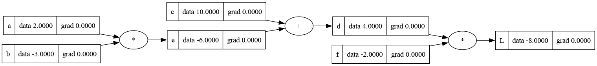
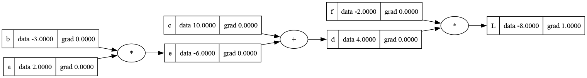
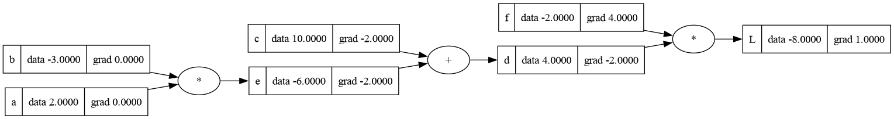
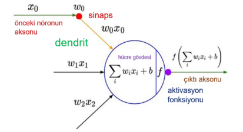
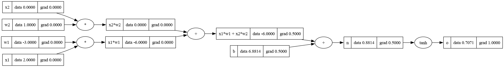

## 🎬 Canlı Eğitim Simülasyonu

3 epoch boyunca adım adım **ileri besleme** ve **geri yayılım** sürecini gösteren animasyon:


# 🧠 Nöral Ağ Nedir?


Nöral ağ, bilgisayarın verilerden öğrenmesini sağlayan bir sistemdir.

İçinde birçok küçük yapay "nöron" bulunur. Her nöron birkaç sayı alır (girdi), bunları işler ve bir sonuç (çıktı) üretir.

---

## ⚙️ Nöron Nasıl Çalışır?

Önce tüm girdiler kendi **ağırlıklarıyla (w)** çarpılır, sonra bu değerler toplanır ve küçük bir **bias (b)** eklenir:

$$
n = (x_1 \cdot w_1) + (x_2 \cdot w_2) + b
$$

Bu işlem sonucu çıkan değer bir **aktivasyon fonksiyonuna** gönderilir. Aktivasyon fonksiyonu, bu sonucu işler ve nöronun çıktısını üretir.

---

## ➕ Bias (b) Nedir?

Bias, nöronun içine eklenen küçük bir sabit değerdir. Bu değer, nöronun çıktısını yukarı veya aşağı kaydırarak daha esnek öğrenmesini sağlar.

Tüm girdiler sıfır olsa bile, bias sayesinde nöron küçük bir çıkış üretebilir.

---

## 🎯 Aktivasyon Fonksiyonu Nedir?

Aktivasyon fonksiyonu, nöronun ürettiği sonucu **yorumlayan ve dönüştüren** bir mekanizmadır.

Bir anlamda nöronun "karar verme noktası"dır. Hangi bilginin iletileceğini, hangisinin bastırılacağını belirler. Bu sayede ağ, sadece basit doğrusal ilişkilerle sınırlı kalmaz; **karmaşık, eğrisel ve çok katmanlı desenleri** de öğrenebilir.

Kısaca, aktivasyon fonksiyonu bir nöronu "hesap makinesinden" çıkarıp **öğrenebilen birime** dönüştürür.

Farklı aktivasyon fonksiyonları farklı davranışlar sağlar:

* **ReLU (Rectified Linear Unit):** Negatif değerleri sıfırlar, pozitifleri olduğu gibi geçirir. Basit ve hızlıdır.
* **tanh:** Sonuçları -1 ile 1 arasına sıkıştırır, daha dengeli bir öğrenme sağlar.

---

**Türevin formülü:**

$$
\mathbf{f'(x) = \lim_{h \to 0} \frac{f(x+h) - f(x)}{h}}
$$

---

Türev alırken seçtiğimiz değişken, **değiştirmek istediğimiz girdidir.**

**Örneğin**

```python
# Matematiksel olarak limit almasanız bile, h değerini bu kadar küçük 
# seçerek pratik olarak türev değerini hesaplamış olursunuz.

h = 0.0001
# inputs
a = 2.0
b = -3.0  # <--- Değişken (Girdi)
c = 10.0
d1 = a*b + c

b += h    # <--- Sadece b'yi değiştiriyoruz.
d2 = a*b + c
print('slope', (d2 - d1)/h)
```

Kodda, $d$ çıktısındaki değişimin $b$'deki küçük bir değişimden $\left(\frac{d_2 - d_1}{h}\right)$ kaynaklandığını ölçtüğünüz için, doğal olarak **$b$'ye göre türev** almanız gerekir.

### $\mathbf{d}$'nin $\mathbf{b}$'ye Göre Türevi ($\mathbf{\frac{dd}{db}}$)

Fonksiyonumuz: $d = a \cdot b + c$

---

### 1. Adım: Türev Operatörünü Uygulama

Tüm ifadeye $b$'ye göre türev alma komutunu ($\frac{d}{db}$) uygularız. Toplama kuralı gereği, her terimin türevi ayrı ayrı alınır.

$$
\frac{d}{db}(d) = \frac{d}{db} (a \cdot b) + \frac{d}{db} (c)
$$

---

### 2. Adım: Sabit Terimin Türevi

$c$ değişkeni, türev alınan değişkene ($b$) bağlı olmadığı için **sabittir**. Bir sabitin türevi daima sıfırdır.

$$
\frac{d}{db} (c) = 0
$$

---

### 3. Adım: Katsayılı Değişkenin Türevi

$a \cdot b$ teriminde, $a$ bir **sabit katsayıdır**. $b$'nin $b$'ye göre türevi ise $1$'dir. Katsayı olduğu gibi kalır ve değişkenin türevi ile çarpılır.

$$
\frac{d}{db} (a \cdot b) = a \cdot \underbrace{\frac{d}{db} (b)}_{1} = a
$$

---

### 4. Adım: Sonucu Birleştirme

Bulduğumuz sonuçları topladığımızda, $d$'nin $b$'ye göre türevi ($\frac{dd}{db}$) elde edilir.

$$
\frac{dd}{db} = a + 0 = a
$$

**Kısaca Çıkarım:** $d$ çıktısındaki değişim, $b$ girdisindeki değişimin **tam $a$ katıdır**. Yapay zeka bu $a$ değerini (gradyanı) kullanarak ağırlıkları ayarlar.

Aynı şekilde $b$ yerine $a$'yı değiştirseydik, bu sefer $d$'nin $a$'ya göre türevini almış olurduk. Bu durumda da $d$'nin $a$'ya göre türevi bize $b$'yi verirdi.

---

### $\mathbf{d}$'nin $\mathbf{c}$'ye Göre Türevi ($\mathbf{\frac{dd}{dc}}$)

Bu sefer $\frac{d}{dc}$ komutunu uyguluyoruz; yani $\mathbf{c}$ değişkendir, $a$ ve $b$ sabittir.

$\frac{dd}{dc} = \frac{d}{dc} (a \cdot b + c)$

1. **Sabit Çarpımının Türevi:** $a \cdot b$ terimi, türev aldığımız $c$ değişkenine bağlı değildir. Dolayısıyla **tamamı sabittir** ve sabitin türevi $\mathbf{0}$'dır.
   
   $\frac{d}{dc} (a \cdot b) = \mathbf{0}$

2. **Değişkenin Türevi:** $c$'nin $c$'ye göre türevi ($\frac{d}{dc}(c)$) her zaman $\mathbf{1}$'dir.
   
   $\frac{d}{dc} (c) = \mathbf{1}$

### Sonuç

Türevleri topladığımızda: $\frac{dd}{dc} = 0 + 1 = \mathbf{1}$

**Kısaca Çıkarım:**

Bu, $c$'yi (bias/sapma) bir birim artırırsanız, $d$ çıktısının da **tam olarak bir birim** artacağını gösterir. Eğimin $\mathbf{1}$ olması, $c$'nin $d$ üzerindeki etkisinin bire bir olduğunu ifade eder.

**Yapay Zeka Bağlamı:** $c$ bir **sapma (bias)** terimini temsil eder. Sapmanın gradyanı her zaman $1$'dir, çünkü $c$'deki değişim çıktıyı aynı miktarda değiştirir.

**Örneğin:**

```python
h = 0.0001
# inputs
a = 2.0
b = -3.0  
c = 10.0 # <--- Değişken (Girdi)
d1 = a*b + c

c += h    # <--- Sadece b'yi değiştiriyoruz.

# c nin artması d2 nin sonucunu artırır.
d2 = a*b + c
print('slope', (d2 - d1)/h)

# çıktı
slope 0.9999999999976694
```

> **NOT:**
> 
> $d$'nin $c$'ye göre türevini alırken, Python'dan `0.9999999999976694` gibi bir sonuç almanızın nedeni **kayan nokta (floating-point) hassasiyetinden kaynaklanan bir hatadır**.  Bilgisayarlar, ondalıklı sayıları (kayan noktaları) depolarken ve çok küçük $h$ ile yaklaşık hesaplama yaparken **her zaman minik yuvarlama hataları** yapar.

---

Bir sinir ağının nasıl öğrendiğini anlamanın temeli, aslında çok basit bir matematik fikrine dayanır:

$\frac{f(x+h) - f(x)}{h}$

Yani **bir fonksiyonun eğimini (değişim hızını)** bulmak.

Bu mantığı sinir ağlarına uyarladığımızda, örneğin

$\frac{dd}{db} = a \quad \text{ve} \quad \frac{dd}{dc} = 1$

gibi türevler karşımıza çıkar. Bu sayılar, modelin “hangi ağırlığı ne kadar değiştirmesi gerektiğini” söyler. Yapay zeka'nın öğrenme süreci aslında bundan ibarettir:

Tahmin hatasını ölçen büyük bir fonksiyon vardır ve ağ, bu hatayı **gradyanı (eğimi)** takip ederek azaltmaya çalışır. Yani bu türevler, ağın geri yayılım (backpropagation) sırasında kullandığı **yön tabelaları** gibidir.

“Bu ağırlığı biraz azalt, şu sapmayı biraz artır” derler.

Görünüşte karmaşık olan sinir ağlarının temelinde aslında **türev almak ve eğimlere göre ayar yapmak** yatar.

---

### Geri Yayılım (Backpropagation) Nedir, Neden ve Nasıl?

Geri Yayılım (Backpropagation), sinir ağlarının **öğrenmesini sağlayan** temel algoritmadır.

| **Soru**           | **Cevap (Kısa ve Basit)**                                                                                                                                                                                                | **micrograd'daki Karşılığı**                                                                                                 |
| ------------------ | ------------------------------------------------------------------------------------------------------------------------------------------------------------------------------------------------------------------------ | ---------------------------------------------------------------------------------------------------------------------------- |
| **Nedir?**         | En sonda yapılan **hata hesaplamasını** alıp, bu hatanın tüm ağ boyunca **geriye doğru** yayılmasıdır.                                                                                                                   | Oluşturduğumuz $\mathbf{Value}$ nesneleri zincirini (grafiği) tersten takip etme.                                            |
| **Neden Yapılır?** | Hata en son çıktıda oluşur, ancak hataya sebep olanlar ilk katmanlardaki **ağırlıklar**dır. Geri Yayılım, her bir ağırlığın ($a$) hataya ne kadar katkıda bulunduğunu (gradyanını) bulmak için yapılır.                  | Ağırlıkların ve sapmaların gradyanını ($\mathbf{\frac{dd}{da}}$, $\mathbf{\frac{dd}{dc}}$) bulmak.                           |
| **Nasıl Yapılır?** | **Zincir Kuralı (Chain Rule)** kullanılarak yapılır. En sondaki hatadan başlanır, her bir işlemde **yerel türev** (o anki işlemin türevi) hesaplanır ve bu türev, arkadan gelen türevle çarpılarak geriye doğru yayılır. | Her $\mathbf{Value}$ nesnesindeki `_backward()` fonksiyonunu, grafik sırasının (topolojik sıralama) **tersinden** çağırarak. |
| **Amacı?**         | Her ağırlığın gradyanı bulunduktan sonra, **ağırlıklar gradyanın tersi yönde** ayarlanır (Gradient Descent). Bu, hatayı minimuma indirmektir.                                                                            | Öğrenmek, yani modeli hatasız hale getirmek.                                                                                 |

**Kısaca:** Geri Yayılım, bir sinir ağının yaptığı hatayı bulduktan sonra, bu hatayı oluşturan **ağırlıkların suçunu (gradyanını)** bulmak için **zincirleme türev alma** işlemidir. Bu sayede, ağırlıkları düzelterek ağın bir sonraki tahminde daha iyi olmasını sağlarız.

### Geri Yayılım (Backpropagation) Başlangıcı

Sinir ağlarının öğrenme sürecinin kritik aşaması olan **Geri Yayılım (Backpropagation)**, sistemdeki hatanın kaynaklarını geriye doğru tespit etmeye odaklanır.

#### 1. Başlangıç Durumu: ($\mathbf{grad = 0}$)

Modelin ileri besleme (forward pass) aşaması tamamlandığında, henüz herhangi bir hata (Loss) hesaplanmamış ve bu hata geriye doğru yayılmaya başlamamıştır. Bu nedenle, sisteme dahil olan tüm değişkenlerin hataya katkısı (gradyanı) başlangıçta **mantıksal olarak 0'dır.**





###### 2. Geri Yayılıma Başlama Noktası: ($\mathbf{L}$'nin $\mathbf{L}$'ye Göre Türevi)

Geri yayılımın kalbi **Zincir Kuralı**dır. Bu kural, hatayı en sondan alıp en baştaki ağırlıklara doğru geri iletmemizi sağlar.

**Hatırlayalım:** Zincir Kuralı, uzun bir işlem zincirinde değişimi bulmak için aradaki tüm yerel türevleri çarpmamızı söyler:

$$
\frac{d c}{d a}=\frac{d c}{d b}\times\frac{d b}{d a}
$$

Geri yayılımı başlatmak için zincirin en sonunda, yani **Nihai Hata ($\mathbf{L}$)** noktasında bir başlangıç değeri tanımlamamız gerekir.

- **Basit Türev Kuralı:** Bir değişkenin kendisine göre türevi daima $\mathbf{1}$'dir.

$$
\frac{d L}{d L}=1
$$

Daha önce gördüğümüz gibi, bir değişkenin kendisine göre türevi daima $\mathbf{1}$'dir. Yani $\mathbf{L}$'nin kendisindeki bir birimlik değişim, $\mathbf{L}$'yi tam olarak bir birim değiştirir. Bu $\mathbf{1}$ sayısı, Geri Yayılım zincirine verdiğimiz **ilk ve en önemli itme gücüdür**. Bu gücü alıp, Zincir Kuralı gereği geriye doğru tüm $\mathbf{Value}$ nesnelerinin yerel türevleriyle çarpmaya başlarız.





### 3. Sorumluluğu Dağıtma: $\mathbf{L}$'nin $\mathbf{d}$ ve $\mathbf{f}$ İle Türevlerini Bulma

Geri Yayılımda başlangıç komutunu ($\mathbf{L.grad = 1}$) verdikten sonra, şimdi bu sorumluluğu $\mathbf{L}$'yi oluşturan önceki düğümlere ($\mathbf{d}$ ve $\mathbf{f}$) dağıtmamız gerekiyor.

**Unutmayalım:** $\mathbf{L}$'nin $\mathbf{d}$ ve $\mathbf{f}$ ile ilişkisi çarpma işlemidir: $\mathbf{L = d \cdot f}$.

**A)** $\mathbf{L}$'nin $\mathbf{d}$'ye Göre Türevi:

| **Adım**             | **İşlem (Limit Tanımı)**                      | **Açıklama (Neden Bu Değişimi Yaptık?)**                                                                                                                                                          |
| -------------------- | --------------------------------------------- | ------------------------------------------------------------------------------------------------------------------------------------------------------------------------------------------------- |
| **Başlangıç**        | $\frac{f(x+h) - f(x)}{h}$ formülü             | **Genel Kural:** Değişim hızını bulmak için $\mathbf{x}$ yerine $\mathbf{d}$'yi, $\mathbf{f(x)}$ yerine nihai sonuç $\mathbf{L}$'yi koyuyoruz.                                                    |
| **Değişim Uygulama** | $\frac{(d+h) \cdot f - d \cdot f}{h}$         | **Kurala Uyum:** $\mathbf{L = d \cdot f}$ olduğu için, $\mathbf{d}$'yi $\mathbf{h}$ kadar artırıp ($\mathbf{d+h}$ yaparak) çıkan yeni $\mathbf{L}$ sonucunu hesapladık ve eski sonuçtan çıkardık. |
| **Parantezi Açma**   | $\frac{d \cdot f + h \cdot f - d \cdot f}{h}$ | Çarpmayı dağıtıp, hangi terimlerin birbirini götüreceğini görme aşaması.                                                                                                                          |
| **Sadeleştirme**     | $\frac{h \cdot f}{h}$                         | $\mathbf{d \cdot f}$ terimleri birbirini sıfırladı. Geriye, $\mathbf{h}$ değişikliğinden kaynaklanan **saf değişim** kaldı.                                                                       |
| **Nihai Sonuç**      | $\mathbf{f}$                                  | $\mathbf{h}$'leri sadeleştirdik. Kalan $\mathbf{f}$, $\mathbf{d}$'deki değişimin $\mathbf{L}$'yi tam olarak $\mathbf{f}$ kadar etkilediğini gösteren **hız katsayımızdır**.                       |

**B)** $\mathbf{L}$'nin $\mathbf{f}$'ye Göre Türevi

Bu sefer $\mathbf{f}$'nin $\mathbf{L}$'ye olan yerel sorumluluğunu buluyoruz. Bu, ilk durumun simetriğidir. Yani Sonuç **d** dir.

Özetle, $\mathbf{L = d \cdot f}$ çarpma işlemi için, $\mathbf{d}$'nin gradyanı ($\frac{dL}{dd}$) direkt olarak $\mathbf{f}$'nin veri değeri (data) olur. Aynı şekilde $\mathbf{f}$'nin gradyanı $\frac{dL}{df}$, $\mathbf{d}$'nin veri değeri (data) olur.


**KISACA**
Unutmayalım ki, $\mathbf{L = d \cdot f}$ işleminde biz **sadece bir sayının** (mesela $d$'nin) değiştiğini düşünüyoruz. Diğer sayı ($f$) o anlık için **sabittir**.

#### 1. $\mathbf{L}$'nin $\mathbf{d}$'ye Göre Türevi ($\mathbf{\frac{\partial L}{\partial d}}$)

- **Basit Mantık:** Diyelim ki $\mathbf{f}$'nin değeri $\mathbf{5}$ olsun. İşlemimiz $\mathbf{L = d \cdot 5}$ haline gelir. $\mathbf{d}$'yi 1 birim artırırsam, $\mathbf{L}$'nin sonucu her zaman $\mathbf{5}$ kat artar.

- **Kural:** $\mathbf{5}$ (yani $\mathbf{f}$) bu işlemin **hız katsayısıdır**. Bu yüzden $\mathbf{L}$'nin $\mathbf{d}$'ye göre türevi direkt olarak $\mathbf{f}$'nin kendisine eşittir.
  
  $\mathbf{\frac{\partial L}{\partial d} = f}$

#### 2. $\mathbf{L}$'nin $\mathbf{f}$'ye Göre Türevi ($\mathbf{\frac{\partial L}{\partial f}}$)

- **Simetrik Mantık:** Diyelim ki $\mathbf{d}$'nin değeri $\mathbf{4}$ olsun. İşlemimiz $\mathbf{L = 4 \cdot f}$ haline gelir. $\mathbf{f}$'yi 1 birim artırırsam, $\mathbf{L}$'nin sonucu her zaman $\mathbf{4}$ kat artar.

- **Kural:** $\mathbf{4}$ (yani $\mathbf{d}$) bu işlemin **hız katsayısıdır**. Bu nedenle, $\mathbf{L}$'nin $\mathbf{f}$'ye göre türevi direkt olarak $\mathbf{d}$'nin kendisine eşittir:

$\mathbf{\frac{\partial L}{\partial f} = d}$

### 4. Sorumluluğu Dağıtma: $\mathbf{L}$'den $\mathbf{c}$ ve $\mathbf{e}$'ye Zincirleme

Bizim nihai amacımız, $\mathbf{L}$'deki hatayı, $\mathbf{c}$ ve $\mathbf{e}$ gibi en baştaki girdilere kadar geri iletmektir. Bu, **Zincir Kuralı (Chain Rule)** ile yapılır.

$\mathbf{\frac{\partial L}{\partial c} = \frac{\partial L}{\partial d} \times \frac{\partial d}{\partial c}}$

Bu formülde:

- $\mathbf{\frac{\partial L}{\partial d}}$ (Arka Gradyan): $\mathbf{L}$'den $\mathbf{d}$'ye gelen hatadır (önceki adımda hesaplanmıştır).

- $\mathbf{\frac{\partial d}{\partial c}}$ (Yerel Türev): Şu an hesapladığımız yerel etkidir.

**A)** $\mathbf{d}$'nin $\mathbf{c}$'ye Göre Yerel Türevi ($\mathbf{\frac{\partial d}{\partial c}}$)

$\mathbf{d = e + c}$ toplama işlemi için $\mathbf{c}$'ye göre yerel türevi buluyoruz.``

| **Adım**             | **İşlem (Limit Tanımı)**          | **Açıklama (Toplama İşlemi için Uygulama)**                                                                                                      |
| -------------------- | --------------------------------- | ------------------------------------------------------------------------------------------------------------------------------------------------ |
| **Başlangıç**        | $\frac{f(x+h) - f(x)}{h}$ formülü | **Genel Kural:** Değişim hızını bulmak için $\mathbf{x}$ yerine $\mathbf{c}$'yi, $\mathbf{f(x)}$ yerine $\mathbf{d}$'yi koyuyoruz.               |
| **Değişim Uygulama** | $\frac{(e + (c+h)) - (e + c)}{h}$ | **Kurala Uyum:** $\mathbf{c}$'yi $\mathbf{h}$ kadar artırıp çıkan yeni $\mathbf{d}$ sonucunu hesapladık ve eski sonuçtan çıkardık.               |
| **Parantezi Açma**   | $\frac{e + c + h - e - c}{h}$     | Pay kısmında terimlerin birbirini götüreceğini görme aşaması.                                                                                    |
| **Sadeleştirme**     | $\frac{h}{h}$                     | $\mathbf{e}$ ve $\mathbf{c}$ terimleri birbirini sıfırladı. Geriye sadece **saf $\mathbf{h}$ değişimi** kaldı.                                   |
| **Nihai Sonuç**      | $\mathbf{1}$                      | $\mathbf{h}$'ler sadeleşti. Kalan $\mathbf{1}$, $\mathbf{c}$'deki değişimin $\mathbf{d}$'yi **birebir** etkilediğini gösteren hız katsayımızdır. |

**B)** $\mathbf{d}$'nin $\mathbf{e}$'ye Göre Yerel Türevi ($\mathbf{\frac{\partial d}{\partial e}}$)

Aynı işlemi $\mathbf{e}$ için uygularsak, sonuç yine aynı olur.

$\mathbf{\frac{\partial d}{\partial e} = 1}$

**C)** Nihai Gradyan Hesaplaması ($\mathbf{L}$'nin $\mathbf{c}$ ve $\mathbf{e}$'ye Göre Türevi)

Şimdi elimizdeki bilgileri Zincir Kuralı'nda birleştirerek $\mathbf{c}$ ve $\mathbf{e}$'nin nihai gradyanını buluyoruz.

**Verilen Değerler (Örnek Grafik Çıktısından):**

- $\mathbf{\frac{\partial L}{\partial d}}$ (Arka Gradyan) = $\mathbf{-2}$ (Bu değer, $\mathbf{L=d \cdot f}$ işleminden $\mathbf{f}$'nin değeri olan $-2$'dir.)

- Yerel Türevler = $\mathbf{1}$

**I.** $\mathbf{c}$'nin Nihai Gradyanı ($\mathbf{\frac{\partial L}{\partial c}}$)

$\mathbf{\frac{\partial L}{\partial c} = \underbrace{\frac{\partial L}{\partial d}}_{\text{Arka Gradyan}} \times \underbrace{\frac{\partial d}{\partial c}}_{\text{Yerel Türev}}}$

$\mathbf{\frac{\partial L}{\partial c} = (-2) \times (1) = -2}$

- **Çıkarım:** $\mathbf{c}$'nin hataya olan nihai sorumluluğu **$-2$**'dir.

** II.** $\mathbf{e}$'nin Nihai Gradyanı ($\mathbf{\frac{\partial L}{\partial e}}$)

$\mathbf{\frac{\partial L}{\partial e} = \underbrace{\frac{\partial L}{\partial d}}_{\text{Arka Gradyan}} \times \underbrace{\frac{\partial d}{\partial e}}_{\text{Yerel Türev}}}$

$\mathbf{\frac{\partial L}{\partial e} = (-2) \times (1) = -2}$

- **Çıkarım:** $\mathbf{e}$'nin hataya olan nihai sorumluluğu da **$-2$**'dir.

**Özetle:** Bir toplama işleminde, $\mathbf{d}$'den geriye gelen hata sinyali ($-2$), iki girdiye ($\mathbf{c}$ ve $\mathbf{e}$) **değişmeden, eşit olarak** dağıtılır.





### 5. Sorumluluğu Dağıtma: $\mathbf{e}$'den $\mathbf{a}$ ve $\mathbf{b}$'ye Geçiş (Zincirin Sonu)

Bu son adımda, $\mathbf{e}$'ye ulaşan hatayı ($\frac{\partial L}{\partial e} = -2$) alıp, $\mathbf{e}$'yi oluşturan en baştaki girdilere ($\mathbf{a}$ ve $\mathbf{b}$) dağıtmalıyız.

**A)** $\mathbf{e}$'nin $\mathbf{a}$'ya Göre Yerel Türevi ($\mathbf{\frac{\partial e}{\partial a}}$)

$\mathbf{e}$'nin oluşumu da bir **çarpma işlemidir**: $\mathbf{e = a \cdot b}$.

| **Adım**             | **İşlem (Limit Tanımı)**                      | **Açıklama (Çarpma İşlemi için Uygulama)**                                                                                                                         |
| -------------------- | --------------------------------------------- | ------------------------------------------------------------------------------------------------------------------------------------------------------------------ |
| **Başlangıç**        | $\frac{f(x+h) - f(x)}{h}$ formülü             | **Genel Kural:** Değişim hızını bulmak için $\mathbf{x}$ yerine $\mathbf{a}$'yı, $\mathbf{f(x)}$ yerine $\mathbf{e}$'yi koyuyoruz.                                 |
| **Değişim Uygulama** | $\frac{(a+h) \cdot b - a \cdot b}{h}$         | **Kurala Uyum:** $\mathbf{a}$'yı $\mathbf{h}$ kadar artırıp çıkan yeni $\mathbf{e}$ sonucunu hesapladık ve eski sonuçtan çıkardık.                                 |
| **Parantezi Açma**   | $\frac{a \cdot b + h \cdot b - a \cdot b}{h}$ | Çarpmayı dağıttık. $\mathbf{a \cdot b}$ terimlerinin birbirini götüreceğini görme aşaması.                                                                         |
| **Sadeleştirme**     | $\frac{h \cdot b}{h}$                         | $\mathbf{a \cdot b}$ terimleri birbirini sıfırladı. Geriye, $\mathbf{h}$ değişikliğinden kaynaklanan **saf değişim** kaldı.                                        |
| **Nihai Sonuç**      | $\mathbf{b}$                                  | $\mathbf{h}$'ler sadeleşti. Kalan $\mathbf{b}$, $\mathbf{a}$'daki değişimin $\mathbf{e}$'yi tam olarak $\mathbf{b}$ kadar etkilediğini gösteren hız katsayımızdır. |

$\mathbf{\frac{\partial e}{\partial a} = b}$

**B.** $\mathbf{e}$'nin $\mathbf{b}$'ye Göre Türevi

Aynı işlemi $\mathbf{b}$ için uygularsak, sonuç yine aynı olur.

$\mathbf{\frac{\partial e}{\partial b} = a}$

**C.** Nihai Gradyan Hesaplaması ve Geri Yayılımın Sonu

Şimdi $\mathbf{e}$'den gelen arka gradyanı ($\mathbf{-2}$) alıp, Zincir Kuralı ile son düğümlere ($\mathbf{a}$ ve $\mathbf{b}$) iletiyoruz.

**Verilen Değerler (Örnek Grafik Çıktısından):**

- $\mathbf{\frac{\partial L}{\partial e}}$ (Arka Gradyan) = $\mathbf{-2}$

- $\mathbf{a}$'nın Veri Değeri: $\mathbf{2.0}$

- $\mathbf{b}$'nin Veri Değeri: $\mathbf{-3.0}$

#### I. $\mathbf{a}$'nın Nihai Gradyanı ($\mathbf{\frac{\partial L}{\partial a}}$)

$\mathbf{\frac{\partial L}{\partial a} = \underbrace{\frac{\partial L}{\partial e}}_{\text{Arka Gradyan}} \times \underbrace{\frac{\partial e}{\partial a}}_{\text{Yerel Türev (b)}}}$

$\mathbf{\frac{\partial L}{\partial a} = (-2) \times (-3.0) = \mathbf{6.0}}$

- **Çıkarım:** $\mathbf{a}$'nın gradyanı $\mathbf{6.0}$ olur.

#### II. $\mathbf{b}$'nin Nihai Gradyanı ($\mathbf{\frac{\partial L}{\partial b}}$)

$\mathbf{\frac{\partial L}{\partial b} = \underbrace{\frac{\partial L}{\partial e}}_{\text{Arka Gradyan}} \times \underbrace{\frac{\partial e}{\partial b}}_{\text{Yerel Türev (a)}}}$

$\mathbf{\frac{\partial L}{\partial b} = (-2) \times (2.0) = \mathbf{-4.0}}$

- **Çıkarım:** $\mathbf{b}$'nin gradyanı $\mathbf{-4.0}$ olur.

**Geri Yayılım Bitti:** Tüm gradyanlar hesaplandı! Sinir ağı artık bu değerleri ($\mathbf{6.0}$, $\mathbf{-4.0}$, $-2$ vb.) kullanarak ağırlıklarını güncelleyebilir.


Harika! Tüm o türev hesaplamalarını ve zincir kuralını neden yaptığımızı, yani Geri Yayılımın (Backpropagation) sinir ağlarında ne anlama geldiğini şimdi özetliyoruz.

### 6. Geri Yayılımın Sonu: Öğrenme Başlıyor

Şimdiye kadar yaptığımız şey, bir sinir ağının yaptığı **hata için bir suç haritası çıkarmaktı.** O karmaşık Zincir Kuralı ve tablolarla bulduğumuz $\mathbf{6.0}$, $\mathbf{-4.0}$ veya $\mathbf{f}$ gibi tüm sayılar, bu haritanın üzerindeki **gradyanlardır (eğimlerdir)**.

#### 1. Bu Değerleri Neden Bulduk? (Amacımız)

Bulduğumuz her bir gradyan değeri (örneğin $\mathbf{\frac{\partial L}{\partial a}} = \mathbf{+6.0}$), $\mathbf{L}$ (Hata/Loss) fonksiyonunun, $\mathbf{a}$ ağırlığına göre ne kadar hızlı ve hangi yönde değiştiğini gösteren net bir ölçümdür. Bu, bir pusula görevi görür; eğer gradyan pozitif ve yüksekse (ör:$\mathbf{+6.0}$), bu, $\mathbf{a}$ ağırlığını artırmamız durumunda hatanın çok hızlı artacağı anlamına gelir. Dolayısıyla, hatayı azaltmak için, ağırlığı gradyanın gösterdiği yönün **tam tersine**, yani **azaltma** yönüne doğru hareket ettirmemiz gerektiğini anlarız.

#### 2. Bu Değerlere Ne Yapılacak? (Gradient Descent)

Bulunan gradyanlar **hemen kullanılır**. Bu, sinir ağlarının öğrenme kuralı olan **Gradyan İnişi (Gradient Descent)** adımıdır:

$\mathbf{\text{Yeni Ağırlık} = \text{Eski Ağırlık} - (\text{Öğrenme Oranı} \times \text{Gradyan})}$

- **Öğrenme Oranı**, ağın her adımda ne kadar **küçük** veya **büyük** bir düzeltme yapacağını belirlerken; gradyanın yönü, o ağırlığın hatayı azaltmak için **artırılması** mı yoksa **azaltılması** mı gerektiğini söyler.

**Kısaca:** Geri Yayılım ile bulduğumuz gradyanlar, hemen bu formüle girerek **ağırlıkların ayarlanmasını sağlar**.

#### 3. Loss Fonksiyonu Gerçekte Nasıl Kullanılır?

Bizim örneğimizde sadece $L$ ile çalıştık, ama gerçekte sinir ağı eğitimi şöyledir:

1. **Tahmin:** Ağ bir çıktı ($y_{tahmin}$) üretir.

2. **Hata Hesaplama (Loss Function):** Bu çıktı ile doğru cevap ($y_{gerçek}$) arasındaki fark, genellikle **Kayıp Fonksiyonu (Loss Function)** ile ölçülür. (Örn: $L = (y_{tahmin} - y_{gerçek})^2$).

3. **Geri Yayılım:** Geri Yayılım, $\mathbf{L}$'den başlayarak hatayı geriye yayar.

4. **Ağırlık Güncelleme:** Gradyanlar kullanılarak ağırlıklar hatayı azaltacak şekilde ayarlanır.

Bu döngü binlerce kez tekrarlandıkça, ağın ağırlıkları en uygun hale gelir ve hata minimuma iner.

### Özet

Geri Yayılımı bitirerek elde ettiğimiz tüm $\mathbf{grad}$ değerleri, sinir ağımızın **bir sonraki denemede daha akıllı olmasını sağlayan komutlardır.** Bu değerler, Gradyan İnişi formülü ile ağırlıklara hemen etki eder ve ağın öğrenme döngüsünü tamamlar.

---

# 2. Örnek: Manuel Geri Yayılım





Şimdi yapıya göre ikinci bir manuel geri yayılım yapacağız. Kısaca yapacağımız şey:

**Girdiler ve Ağırlıklar:** $x1$ ve $x2$ girdilerimiz olacak ve $w1$ ve $w2$ ağırlıklarımız olacak bu girdiler için. Bu, hücre gövdesinin solunda kalan kısım.

**Hücre Gövdesi:** Yapmamız gereken gelen girdileri ağırlıklarla çarpıp toplayarak toplama bias ($b$) eklemek. Kısaca $x1$ ve $x2$ girdisi için:

$$
(x_1 \cdot w_1 + x_2 \cdot w_2) + b
$$

Ardından bu çıktıyı aktivasyon fonksiyonuna ekleyeceğiz:

$$
\tanh((x_1 \cdot w_1 + x_2 \cdot w_2) + b)
$$

Bu bizim genel ileri besleme sistemimiz olacak. Şimdi bu adımdan sonra geri yayılıma bakalım.

---

## 1. Adım: Başlangıç Durumu


İlk aşamada tüm gradyanlar 0 olur.

Şimdi son olan gradyanı bulalım. En üst kısımda anlattığımız için, bir değerin kendine göre türevi her zaman birdir, yani $\frac{do}{do} = 1$ olur. O yüzden $o$'nun türevi $1$ olur.


## 2. Adım: $n$'nin Türevini Bulma

$n$'nin türevi için $o$'nun $n$'ye göre türevine bakmamız lazım ki bu da üst kısımda yaptığımız gibi:

$$
\displaystyle \frac{e^{2x}-1}{e^{2x}+1}
$$

$\frac{f(x+h) - f(x)}{h}$ formüle girdi olarak verebiliriz:

$$
\displaystyle f(x) = \frac{e^{2x}-1}{e^{2x}+1}
$$

Fonksiyonunu limit tanımıyla türev adımlarına dönüştürelim. Tablo şöyle olur:

| **Adım**                           | **İşlem (Limit Tanımı / Açıklama)**                                                                                                                              | **Açıklama (tanh için uygulama)**                                                                                                                     |
| ---------------------------------- | ---------------------------------------------------------------------------------------------------------------------------------------------------------------- | ----------------------------------------------------------------------------------------------------------------------------------------------------- |
| **Başlangıç**                      | $\frac{f(x+h) - f(x)}{h}$                                                                                                                                        | **Genel Kural:** Türevi bulmak için limit tanımını kullanıyoruz. Burada $f(x) = \tanh(x) = \frac{e^{2x}-1}{e^{2x}+1}$                                 |
| **Değişim Uygulama**               | $\frac{\frac{e^{2(x+h)}-1}{e^{2(x+h)}+1} - \frac{e^{2x}-1}{e^{2x}+1}}{h}$                                                                                        | (x) değerini (x+h) ile değiştirdiğimizde çıkan yeni fonksiyon değerini eski değerden çıkarıyoruz.                                                     |
| **Payda Birleştirme**              | $\frac{(e^{2(x+h)}-1)(e^{2x}+1) - (e^{2x}-1)(e^{2(x+h)}+1)}{h \cdot (e^{2(x+h)}+1)(e^{2x}+1)}$                                                                   | İki kesiri tek paydada birleştirdik, limit formülünü uygulamak için.                                                                                  |
| **Parantezi Açma**                 | $\frac{e^{2(x+h)+2x}+e^{2(x+h)} - e^{2x}-1 - e^{2x+2(x+h)} - e^{2x} + e^{2(x+h)} +1}{h \cdot (e^{2(x+h)}+1)(e^{2x}+1)}$                                          | Çarpımları dağıtarak terimleri sadeleştirmeye hazır hale getiriyoruz.                                                                                 |
| **Sadeleştirme**                   | $\frac{2h \cdot e^{2x} + \mathcal{O}(h^2)}{h \cdot (e^{2x}+1)^2}$                                                                                                | $Limit (h \to 0) $alınırken sadece **h ile orantılı terimler** kalır, yüksek mertebeden küçük terimler ihmal edilir.                                  |
| **Nihai Sonuç (Exponential Form)** | $\displaystyle \frac{2 e^{2x}}{(e^{2x}+1)^2}$                                                                                                                    | Türevin **exponential formu**.                                                                                                                        |
| **Nihai Sonuç ($\tanh$ Formu)**    | $\displaystyle 1 - \tanh^2(x) = 1 - \left(\frac{e^{2x}-1}{e^{2x}+1}\right)^2 = \frac{(e^{2x}+1)^2 - (e^{2x}-1)^2}{(e^{2x}+1)^2} = \frac{2 e^{2x}}{(e^{2x}+1)^2}$ | Exponential formu, $\tanh$ tanımını kullanarak sadeleştirildi. Böylece $\displaystyle \frac{2 e^{2x}}{(e^{2x}+1)^2} = 1 - \tanh^2(x)$ olarak yazılır. |

---

💡 **Not:** Son adımda, $\displaystyle \frac{2 e^{2x}}{(e^{2x}+1)^2}$ ifadesi $1 - \tanh^2(x)$ ile eşdeğerdir.

Ya da daha kısaca $\tanh$'ın türevine internetten bakacak olursak, örneğin Vikipedi'de $\tanh$'ın türevi aşağıdaki gibidir:

$$
\displaystyle \frac{d}{dx} \tanh x = 1 - \tanh^2 x = \operatorname{sech}^2 x = \frac{1}{\cosh^2 x}
$$

Formülünden direkt $1 - \tanh^2(x)$ bunu biliriz. Biz burada $\tanh()$ değerini biliyoruz:

$$
\displaystyle \frac{do}{dn} = 1 - \tanh(n)^2
$$

Biz $\tanh(n)$'in $o$ olduğunu biliyoruz, o zaman:

$$
1 - o^2
$$

Bu da grafikten $o.\text{data} = 0.7071$ dir ve $1 - 0.7071^2 = 0.5$ olur.

O zaman $n$'nin gradyanı $0.5$ olur.


# 3. Sorumluluğu Dağıtma: (o)’dan (x1w1x2w2) ve (b)’ye Zincirleme

Bizim nihai amacımız, (o)’daki hatayı, **x1w1x2w2** ve **b** gibi en baştaki girdilere kadar geri iletmektir. Bu, **Zincir Kuralı (Chain Rule)** ile yapılır.

$\frac{\partial o}{\partial x} = \frac{\partial o}{\partial n} \times \frac{\partial n}{\partial x} $

Burada:

- $\frac{\partial o}{\partial n}$ (Arka Gradyan): o’dan n’ye gelen hatadır (önceki adımda tanh türevinden hesaplanmıştır, örn: 0.5).

- $\frac{\partial n}{\partial x}$ (Yerel Türev): Şu an hesapladığımız yerel etkidir.

---

## **A)** (n)'nin (x1w1x2w2)'ye Göre Yerel Türevi $\frac{\partial n}{\partial x1w1x2w2}$

$n = x1w1x2w2 + b$

| **Adım**             | **İşlem (Limit Tanımı)**                        | **Açıklama (Toplama İşlemi için Uygulama)**                                      |
| -------------------- | ----------------------------------------------- | -------------------------------------------------------------------------------- |
| **Başlangıç**        | $\frac{f(x+h) - f(x)}{h}$                       | Genel kural: değişim hızını bulmak için $x \to x1w1x2w2$, $f(x) \to n$ koyuyoruz |
| **Değişim Uygulama** | $\frac{(x1w1x2w2 + h + b) - (x1w1x2w2 + b)}{h}$ | x1w1x2w2'yi h kadar artırıp çıkan yeni n değerini eski n değerinden çıkardık     |
| **Parantezi Açma**   | $\frac{x1w1x2w2 + h + b - x1w1x2w2 - b}{h}$     | Terimleri açıyoruz                                                               |
| **Sadeleştirme**     | $\frac{h}{h}$                                   | b terimi birbirini götürdü, geriye sadece h kaldı                                |
| **Nihai Sonuç**      | 1                                               | x1w1x2w2'deki değişimin n'yi birebir etkilediğini gösterir                       |

---

## **B)** (n)'nin (b)'ye Göre Yerel Türevi $\frac{\partial n}{\partial b}$

Aynı işlemi b için uygularsak, sonuç yine aynı olur:

$\frac{\partial n}{\partial b} = 1$

---

## **C)** Nihai Gradyan Hesaplaması ((o)'nun (x1w1x2w2) ve (b)'ye Göre Türevi)

Şimdi elimizdeki bilgileri Zincir Kuralı’nda birleştiriyoruz:

**Verilen Değerler (Örnek):**

- $\frac{\partial o}{\partial n}$ (Arka Gradyan) = 0.5 (tanh türevinden)

- Yerel türevler = 1

---

**I.** (x1w1x2w2)’nin Nihai Gradyanı

$\frac{\partial o}{\partial x1w1x2w2} = \underbrace{\frac{\partial o}{\partial n}}*{\text{Arka Gradyan}} \times \underbrace{\frac{\partial n}{\partial x1w1x2w2}}*{\text{Yerel Türev}} $

$\frac{\partial o}{\partial x1w1x2w2} = 0.5 \times 1 = 0.5 $

- **Çıkarım:** x1w1x2w2’nin hataya olan nihai sorumluluğu **0.5**’tir.

---

**II.** (b)’nin Nihai Gradyanı

$\frac{\partial o}{\partial b} = \underbrace{\frac{\partial o}{\partial n}}*{\text{Arka Gradyan}} \times \underbrace{\frac{\partial n}{\partial b}}*{\text{Yerel Türev}} $

$\frac{\partial o}{\partial b} = 0.5 \times 1 = 0.5 $

- **Çıkarım:** b’nin hataya olan nihai sorumluluğu da **0.5**’tir.

---

**Özetle:** Bir toplama işleminde, **o’dan geriye gelen hata sinyali (0.5)**, iki girdiye ((x1w1x2w2) ve b) **değişmeden, eşit olarak** dağıtılır.





## 4. Adım: Sorumluluğu Dağıtma - $o$'dan $x1w1$ ve $x2w2$'ye Zincirleme

Yapı, 3. aşamadaki **n = x1w1x2w2 + b** mantığıyla tamamen aynıdır. Bu nedenle **tüm aşamalar aynı şekilde uygulanır ve sonuçlar da aynı olur**. Yani 3. aşamada n’deki gradyanlar x1w1x2w2 ve b’ye **aynı şekilde aktarılmıştı**.

Zincir kuralından:

$\frac{\partial o}{\partial x} = \frac{\partial o}{\partial n} \times \frac{\partial n}{\partial x}$

Burada $\frac{\partial n}{\partial x1w1} = \frac{\partial n}{\partial x2w2} = 1$ olduğu için gradyanlar 0.5 olarak aktarılır.

* Bu nedenle, **x1w1 ve x2w2’ye de 0.5 değerleri zincirleme ile aktarılır**.

---

### **Sonuçlar (Gradyanlar)**

$\frac{\partial o}{\partial x1w1} = 0.5$

$\frac{\partial o}{\partial x2w2} = 0.5$

$\frac{\partial o}{\partial x1w1x2w2} = 0.5 \quad (\text{3. aşamadan})$

**Not:** Toplama işlemi olduğu için x1w1x2w2 deki grad her parça (x1w1 ve x2w2) gradyanı zincirleme mantığı gereği**eşit şekilde** alır.

## 5. Adım: Sorumluluğu Dağıtma - $x1w1$ ve $x2w2$'den $x_1, w_1, x_2, w_2$'ye Geçiş

Bu son adımda, $x1w1$ ve $x2w2$'ye ulaşan hatayı alıp, bunları oluşturan en baştaki girdilere ($x_1, w_1, x_2, w_2$) dağıtmalıyız.

---

| Adım         | İşlem (Limit Tanımı)                               | Açıklama (Çarpma İşlemi Uygulaması)                                    |
| ------------ | -------------------------------------------------- | ---------------------------------------------------------------------- |
| Başlangıç    | $\frac{f(x+h)-f(x)}{h}$                            | Değişim hızını bulmak için x yerine x1’i, f(x) yerine x1w1’i koyuyoruz |
| Değişim      | $\frac{(x1+h) \cdot w1 - x1 \cdot w1}{h}$          | x1’i h kadar artırıyoruz                                               |
| Açma         | $\frac{x1 \cdot w1 + h \cdot w1 - x1 \cdot w1}{h}$ | Terimleri açıyoruz                                                     |
| Sadeleştirme | $\frac{h \cdot w1}{h}$                             | Geriye sadece h’den kaynaklı değişim kaldı                             |
| Nihai Sonuç  | $w1$                                               | x1’deki değişimin x1w1’i w1 kadar etkilediğini gösterir                |

$\frac{\partial x1w1}{\partial x1} = w1, \quad \frac{\partial x1w1}{\partial w1} = x1$

> **Not:** Burada çarpma işleminin simetrik etkisi var; x1’deki değişim w1 kadar, w1’deki değişim x1 kadar etki yapıyor.

---

### B) x2w2’nin x2’ye ve w2’ye göre yerel türevleri

x2w2 = x2 * w2

$\frac{\partial x2w2}{\partial x2} = w2, \quad \frac{\partial x2w2}{\partial w2} = x2$

> **Not:** Aynı mantık x2w2 için de geçerli. Çarpma işlemi olduğu için, zincir kuralıyla nihai gradyanlar da çarpılarak hesaplanır.

---

### C) Nihai Gradyan Hesaplaması (Geri Yayılım)

x1w1 ve x2w2’den gelen arka gradyanlar:

$\frac{\partial o}{\partial x1w1} = 0.5, \quad \frac{\partial o}{\partial x2w2} = 0.5$

#### I. x1 ve w1

$\frac{\partial o}{\partial x1} = \frac{\partial o}{\partial x1w1} \cdot \frac{\partial x1w1}{\partial x1} = 0.5 * (-3.0) = -1.5$

$\frac{\partial o}{\partial w1} = \frac{\partial o}{\partial x1w1} \cdot \frac{\partial x1w1}{\partial w1} = 0.5 * 2.0 = 1.0$

* **Çıkarım:** x1’in gradyanı -1.5, w1’in gradyanı 1.0 olur.

#### II. x2 ve w2

$\frac{\partial o}{\partial x2} = \frac{\partial o}{\partial x2w2} \cdot \frac{\partial x2w2}{\partial x2} = 0.5 * 1.0 = 0.5$

$\frac{\partial o}{\partial w2} = \frac{\partial o}{\partial x2w2} \cdot \frac{\partial x2w2}{\partial w2} = 0.5 * 0.0 = 0.0$

* **Çıkarım:** x2’nin gradyanı 0.5, w2’nin gradyanı 0.0 olur.

> **Not:** Burada w2 = 0 olduğu için gradyan da 0 oldu; yani bu ağırlık hataya katkıda bulunmuyor.


Elbette! Tüm bu teknik akışı, notlarınıza ekleyebileceğiniz resmi, sade ve öz bir dille özetliyorum.

---

### 📝 Geri Yayılımın Özeti ve Otomasyona Geçiş

Bu aşama, sinir ağının öğrenme döngüsünü tamamlar ve manuel hesaplamadan otomatik sisteme geçişin gerekçesini sunar.

#### I. Gradyan Çıkarımı ve $\mathbf{x_2 = 0}$ Durumu

Geri Yayılım (Backpropagation) zincirleme kuralının uygulanmasıyla her bir ağırlığın ($\mathbf{w}$) ve girdinin ($\mathbf{x}$) hataya olan **sorumluluğu (gradyanı)** bulunur.

- **Sıfır Gradyan:** Hesaplama sırasında $\mathbf{x_2}$ girdisinin değerinin $\mathbf{0}$ olması nedeniyle, çarpım işleminden sonra $\mathbf{w_2}$ ağırlığının gradyanı da $\mathbf{0}$ çıkar. Bunun sezgisel anlamı şudur: $\mathbf{w_2}$'yi değiştirmenin nihai çıktı üzerinde hiçbir etkisi yoktur, çünkü $\mathbf{0}$ ile çarpılmaktadır.
  
  Bu durumun eğitimdeki sonucu şudur: **$\mathbf{w_2}$'nin gradyanı sıfır olduğu için, o ağırlık üzerinden hatayı azaltma çabası imkansızdır; $\mathbf{w_2}$ güncellenmez.** İşte bu noktada, sinir ağının öğrenme enerjisi (Geri Yayılım) otomatik olarak $\mathbf{w_2}$'den uzaklaşır ve hataya gerçekten katkıda bulunan, yani gradyanı sıfırdan farklı olan diğer ağırlıklara (örneğin $\mathbf{w_1}$'e) yönelir. Bu, gradyanların sinir ağında **"hangi parçanın önemli olduğunu"** ve nerenin ayarlanması gerektiğini gösteren hayati bir pusula görevi gördüğünü kanıtlar.

#### II. Otomasyona Geçişin Gereği

- **Manuel Süreç:** Tüm bu gradyanların (örneğin $\mathbf{x_1.grad}, \mathbf{w_1.grad}$) elle hesaplanması, gerçek sinir ağlarındaki milyonlarca parametre düşünüldüğünde **verimsiz ve pratik dışıdır**. İşte bu nedenle, **otomatik türev (autograd)** mekanizmasını kurmak zorundayız. `Value` sınıfına, her bir işlemde (çarpma, toplama vb.) o işlemin yerel türevini hesaplayıp geriye doğru ileten özel bir fonksiyon (`self._backward`) eklenir.
  
  Bu sistem, **Zincir Kuralı'nın küçük bir parçasını** her düğümde hafızaya kaydeder ve gerektiğinde bu kuralları otomatik olarak uygulayarak gradyanları saniyeler içinde hesaplar.
  
  ---

| Aşama                           | Ne Olur?                                                                                                                         | Örnek                                  | Geri Yayılımda Rolü                                                                             |
| ------------------------------- | -------------------------------------------------------------------------------------------------------------------------------- | -------------------------------------- | ----------------------------------------------------------------------------------------------- |
| 1. Giriş (Input)                | Ağ, öğrenmek istediği veriyi alır (sayısal girdiler, x'ler).                                                                     | 3–5 tane girdi                         | Başlangıç noktasıdır, gradyan en son buraya ulaşır.                                             |
| 2. İleri Besleme (Forward Pass) | Girdiler, ağırlıklarla çarpılıp toplanarak katmanlardan geçer. Bu aşamada zincir kurulur.                                        | (a⋅b + c) gibi işlemler                | Zincirin kurulduğu aşamadır (_prev ve _op kaydedilir).                                          |
| 3. Çıktı (Output)               | Ağ bir tahmin (y_tahmin) üretir.                                                                                                 | Çıktı 4.8, kedi                        | Tahminin hatası ölçülür.                                                                        |
| 4. Hata/Kayıp (Loss)            | Tahmin ile gerçek değer (y_gerçek) arasındaki fark, Kayıp Fonksiyonu (L) ile ölçülür.                                            | L = (y_tahmin − y_gerçek)²             | Geri yayılımın başlangıç noktasıdır (L.grad = 1 ile başlar).                                    |
| 5. Geri Yayılım (Backprop)      | L'den gelen hata sinyali, Zincir Kuralı ile tersten tüm ağırlıklara doğru yayılır.                                               | ∂a/∂L = 6.0 gibi gradyanlar hesaplanır | Sorumluluk dağıtılır; her ağırlık, hataya ne kadar katkısı olduğunu öğrenir.                    |
| 6. Güncelleme                   | Bulunan gradyanlar, öğrenme oranı ile çarpılır ve ağırlıklar hatayı azaltacak şekilde ayarlanır (Gradient Descent).              | Yeni Ağırlık = Eski Ağırlık − (…)      | Ağ kendisini düzelterek bir sonraki deneme için hazırlanır.                                     |
| Ek Not                          | Kayıp değeri (L) hakkında: L değeri, geri yayılım hesaplamasında doğrudan kullanılmaz, ancak eğitim sürecinin ana göstergesidir. | —                                      | L, ağın performansını ölçmek ve eğitimin ne zaman durdurulacağına karar vermek için kullanılır. |

--- 
